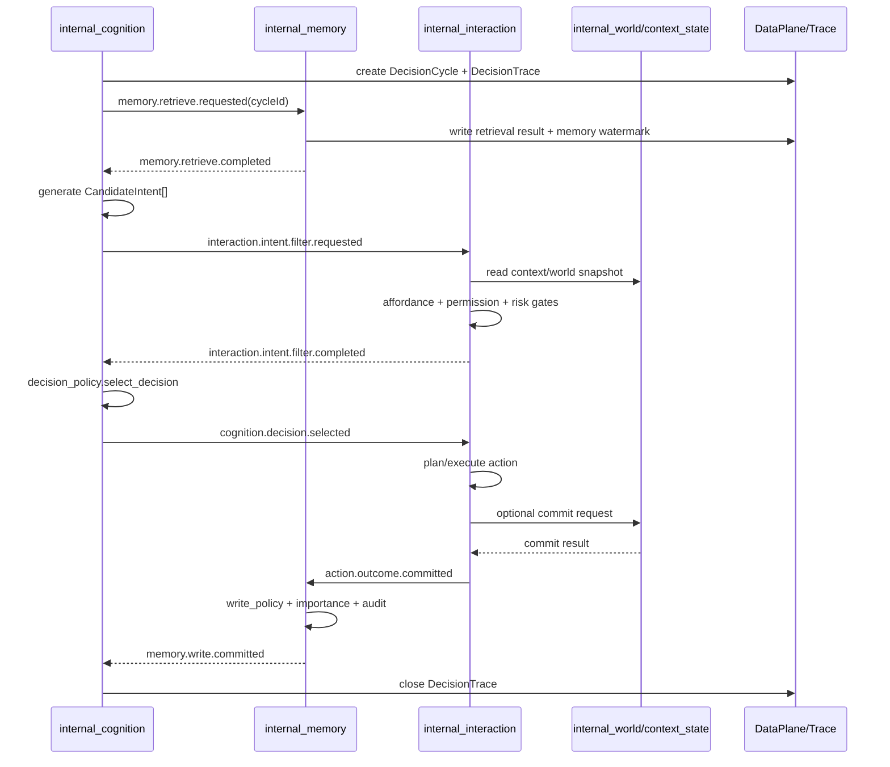

# Stelle Internal Windows 设计稿 v2

> 本稿替换原 `deep-research-report.md` 中过重、过早完整化的方案。它保留 Stelle 现有 `core / debug / capabilities / windows` 四层机制，但把 internal windows 的执行方式从“异步事件自由流”改成“带因果追踪、版本水位和可等待屏障的决策循环”。

## 0. 设计结论

Stelle 不应该在 MVP 阶段复制一个 Smallville 式完整内部世界，也不应该让四个 internal windows 以完全异步的方式各跑各的。正确做法是：

1. 保留现有工程四层：`core`、`capabilities`、`windows`、`debug`。
2. 把 `world / cognition / interaction / memory` 定义为 internal windows，而不是新的工程 layer。
3. 把可复用能力放入 `src/capabilities`，例如 `self_memory`、`cognition`、`interaction_policy`、`world_state`。
4. 把因果追踪、版本水位、事件 envelope、DataPlane ref、资源租约等基础机制放入 `src/core`。
5. MVP 先验证“认知—交互—记忆”的闭环；`internal_world` 先做轻量状态上下文，不做完整物理房间模拟。
6. 所有 LLM 输出只生成候选意图、解释或反思；世界状态和动作执行必须由 typed action、validator、reducer、invariant 维护。

最终目标不是“给 Stelle 做一个看不见的玩具房间”，而是给 Stelle 建立一个可追踪、可解释、可测试的主观决策系统。内部世界只有在能被用户体验、直播表现、动作规划或长期记忆实际使用时才扩展。

## 1. 对原设计审查问题的正式修正

### 1.1 Internal Windows 同步时序

原设计的问题是：`internal_world`、`internal_memory`、`internal_cognition` 通过 EventBus 解耦，但没有定义 happened-before 关系。新的设计引入三个机制：

- `CausalTrace`：每一轮决策都有 `cycleId / correlationId / causationId`。
- `StateWatermark`：认知上下文必须声明它读取到的 `worldVersion / memoryVersion / reflectionVersion`。
- `CycleBarrier`：关键阶段可以等待指定事件完成，例如 `memory.write.committed`，也可以按策略超时降级。

也就是说，Stelle 不再依赖“事件迟早会到”的隐式假设，而是明确记录：这一次认知基于哪个世界版本、哪个记忆版本、哪些反思版本做出了选择。

MVP 中采用更简单的策略：单 agent、单 decision lane、串行 cycle。每轮顺序为：

```text
observe -> retrieve -> deliberate -> filter -> decide -> act -> remember -> optional_reflect -> next_cycle
```

### 1.2 CandidateIntent 可行性循环依赖

原设计让 `CandidateIntent` 自带 `feasibilityHint`，这等于让 LLM 自己生成意图、自己评估可行性。新设计删除 `feasibilityHint` 的决策权重地位。

新的流程是：

```text
LLM 生成 CandidateIntent[]
  -> interaction_policy.resolve_affordances()
  -> interaction_policy.filter_intents()
  -> decision_policy.select_decision()
```

`CandidateIntent` 必须提供“它认为需要什么条件”，但这些条件只作为线索，不作为最终判断。

```ts
export interface CandidateIntent {
  intentId: string;
  actorId: string;
  scope: "reply" | "world" | "stage" | "memory" | "tool";
  summary: string;
  desiredOutcome: string;
  targetRefs?: EntityRef[];
  requiredAffordanceHints?: string[];
  evidenceRefs: EvidenceRef[];
  justification: string;
}
```

可执行性由 `interaction_policy` 基于当前 capability、window、world snapshot、tool permission 做确定性或半确定性检查。

### 1.3 decision_policy 不使用固定魔法权重

原设计中的线性公式过于脆弱。新设计改为“硬门禁 + 可配置评分器”。

第一步是 gate，不通过 gate 的候选不进入打分：

```text
schema_valid
permission_allowed
affordance_available
risk_below_threshold
not_duplicate_recent_action
not_conflicting_with_active_commitment
```

第二步才是 scoring。评分权重来自配置，不硬编码在代码中。

```ts
export interface DecisionPolicyConfig {
  weights: {
    goalFit: number;
    valueAlignment: number;
    memorySupport: number;
    novelty: number;
    continuity: number;
  };
  risk: {
    rejectAbove: number;
    penaltyCurve: "linear" | "quadratic" | "threshold";
  };
}
```

风险不是装饰性扣分。高风险直接拒绝；低风险才进入 penalty。

### 1.4 memory importance 不由 LLM 独裁

原设计的 `importance: 1..10` 如果完全由 LLM 给出，会造成自我强化偏差。新设计改为规则优先、LLM 只做 advisory。

```text
finalImportance = ruleScore + optionalLlmAdjustment - redundancyPenalty
```

规则分来自：

- 用户是否明确要求“记住”。
- 是否形成承诺。
- 是否改变用户偏好。
- 是否影响 Stelle 自我叙事。
- 是否对未来行为有可验证影响。
- 是否与已有记忆重复。

LLM 只能补充解释，不能单独决定长期写入。

### 1.5 reflection 触发机制

反思不再是“有 API 但不知道何时运行”。新设计规定 `internal_memory` 拥有 `ReflectionScheduler`。

触发条件：

| Trigger | 说明 | MVP 是否启用 |
|---|---|---|
| `memory_count` | 新增 N 条重要记忆后触发 | 启用 |
| `importance_sum` | 重要性累计超过阈值 | 启用 |
| `session_end` | 会话结束时总结 | 启用 |
| `negative_feedback` | 用户纠正、拒绝、冲突时触发 | 启用 |
| `idle_time` | 空闲时低优先级执行 | 可选 |
| `debug_manual` | 手动触发 | 启用 |

反思有预算和冷却：

```ts
export interface ReflectionPolicy {
  minNewMemories: number;
  minImportanceSum: number;
  cooldownMs: number;
  maxReflectionsPerHour: number;
  requireEvidenceCount: number;
}
```

反思产物必须带 evidence memory ids；没有证据链的反思不得进入长期记忆。

### 1.6 内部世界的产品价值

新设计承认一个现实：如果用户看不到、Stelle 也不用不到，那内部世界就是成本。MVP 阶段不做完整房间模拟，只做 `ContextState`。

MVP 的 `internal_world` 只维护：

- 当前 interaction context。
- 当前活跃任务。
- 当前可用动作域。
- 与输出表现直接相关的状态，例如 mood、stage posture、topic focus。
- 少量可见物品或场景状态，例如直播间灯光、便签、桌面整洁度。

完整 `room world` 延后到 v2，前提是它至少满足一个条件：

- 能被直播画面展示。
- 能影响动作规划。
- 能被用户询问和验证。
- 能进入长期记忆并影响未来行为。

### 1.7 主观体验不能被四个窗口割裂

新设计规定每轮决策生成一份 `DecisionTrace`。它不是 debug 附属品，而是 explainability 的基础数据结构。

```ts
export interface DecisionTrace {
  cycleId: string;
  correlationId: string;
  actorId: string;
  startedAt: string;
  watermarks: StateWatermark;
  observations: EvidenceRef[];
  memoryHits: EvidenceRef[];
  candidateIntentIds: string[];
  selectedIntentId?: string;
  planId?: string;
  actionResultIds?: string[];
  memoryWriteIds?: string[];
  reflectionIds?: string[];
  status: "running" | "completed" | "failed" | "cancelled";
}
```

用户问“你刚才为什么这么做”，`explain_choice` 不是重新幻想理由，而是读取 `DecisionTrace`、candidate、score breakdown、memory evidence 后生成解释。

### 1.8 EventBus / DataPlane 顺序

新设计采用 outbox 顺序：

```text
1. 在事务中写 VersionedStore / DataPlane
2. 生成 EventEnvelope，内含 dataRefs、version、hash
3. EventBus 发布事件
```

禁止“先发事件，再写快照”。事件中必须包含可验证引用：

```ts
export interface DataRef<TKind extends string = string> {
  kind: TKind;
  uri: string;
  version?: number;
  sha256?: string;
}
```

消费者收到事件后，如果 DataPlane ref 不存在或 hash 不匹配，必须报 `data_ref_unavailable`，不得默默读取旧数据。

### 1.9 VersionedStore 多 world 隔离

`VersionedStore` 是 core 通用机制，但实例必须按 resource partition 运行。不存在全局单锁。

```ts
export interface VersionedStoreKey {
  namespace: string; // world, memory, trace, config
  partitionId: string; // worldId, agentId/scope, cycleId
  objectId: string;
}
```

例如：

```text
world/room/snapshot
world/stream_stage/snapshot
memory/stelle:self/entries
trace/stelle:cycle_001/decision
```

每个 partition 独立版本推进，避免两个 world 互相阻塞。

### 1.10 WorldEntity.state 类型过宽

新设计禁止长期使用裸 `Record<string, unknown>`。允许底层存储为 JSON，但必须通过 schema registry 验证。

```ts
export interface EntitySchema<TState> {
  kind: EntityKind;
  version: string;
  parse(input: unknown): TState;
  defaultState(): TState;
}

export interface WorldEntity<TState = unknown> {
  entityId: string;
  kind: EntityKind;
  schemaVersion: string;
  name: string;
  sceneId: string;
  state: TState;
  location?: EntityLocation;
  tags?: string[];
}
```

MVP 可用轻量 schema validator；后续可接 zod、valibot 或项目已有 schema 工具。

### 1.11 MVP 范围缩减

新 MVP 不再要求一次完成 10 个 capability + 4 个 window + 完整 debug。改成三层推进：

- MVP-0：认知—交互—记忆闭环，无完整 world simulation。
- MVP-1：轻量 `internal_world`，只维护可见状态和任务上下文。
- MVP-2：房间世界、物品状态、reducer/invariant。

### 1.12 LLM 测试策略

所有自动化测试默认不依赖真实 LLM。

- unit test 用 deterministic function。
- integration test 用 mock LLM fixture。
- LLM 行为质量放入 eval，不放入必须稳定通过的单元测试。

`reflection_changes_future_choice.test.ts` 这类测试改名为 eval 或使用固定 mock reflection。

## 2. Stelle 四层架构定位

### 2.1 Core

`core` 只放通用运行机制。它不知道 Stelle 的房间、人格、记忆内容，也不知道 Discord、直播、浏览器的具体语义。

建议新增或确认以下 core 模块：

```text
src/core/protocol/event_envelope.ts
src/core/protocol/data_ref.ts
src/core/protocol/causal_trace.ts
src/core/protocol/state_watermark.ts
src/core/execution/cycle_barrier.ts
src/core/state/versioned_store.ts
src/core/state/outbox.ts
src/core/policy/resource_lease.ts
src/core/debug/debug_provider.ts
```

关键类型：

```ts
export interface EventEnvelope<TName extends string, TPayload> {
  id: string;
  name: TName;
  ts: string;
  source: string;
  correlationId: string;
  causationId?: string;
  cycleId?: string;
  watermarks?: StateWatermark;
  dataRefs?: DataRef[];
  payload: TPayload;
}

export interface StateWatermark {
  world?: Record<string, number>;
  memory?: Record<string, number>;
  reflection?: Record<string, number>;
  config?: Record<string, number>;
}

export interface CycleBarrier {
  cycleId: string;
  waitFor(events: BarrierRequirement[], timeoutMs: number): Promise<BarrierResult>;
}
```

### 2.2 Capabilities

`capabilities` 放可复用能力，不拥有 window 生命周期。

MVP-0 必需：

```text
src/capabilities/cognition/
src/capabilities/decision_policy/
src/capabilities/interaction_policy/
src/capabilities/self_memory/
src/capabilities/reflection/     # 可先只做 scheduler + mock/reflection summary
```

MVP-1 增加：

```text
src/capabilities/context_state/
src/capabilities/value_system/
```

MVP-2 增加：

```text
src/capabilities/world_model/
src/capabilities/world_state/
src/capabilities/world_simulation/
src/capabilities/narrative/
```

注意：为了降低 MVP 成本，`context_state` 先替代完整 `world_state`。它只维护任务上下文、可见舞台状态、当前 conversation focus，不维护严肃物理一致性。

### 2.3 Windows

`windows` 放运行时编排和事件订阅。

MVP-0：

```text
src/windows/internal_cognition/
src/windows/internal_interaction/
src/windows/internal_memory/
```

MVP-1：

```text
src/windows/internal_world/       # 轻量 ContextStateWindow，不做完整房间模拟
```

MVP-2：

```text
src/windows/internal_world/       # 升级为 RoomWorldWindow / StageWorldWindow 多实例
```

### 2.4 Debug

`debug` 只消费 provider，不拥有业务逻辑。

必须先支持：

```text
DecisionTrace view
Memory write audit view
Interaction validation view
Cycle barrier / event lag view
```

完整 world debug 延后到 MVP-2。

## 3. 新版目录结构

```text
src/
  core/
    protocol/
      event_envelope.ts
      data_ref.ts
      causal_trace.ts
      state_watermark.ts
      window_instance.ts
    execution/
      cycle_barrier.ts
      cycle_journal.ts
    state/
      versioned_store.ts
      outbox.ts
    policy/
      resource_lease.ts
    debug/
      debug_provider.ts

  capabilities/
    cognition/
      api.ts
      context_builder.ts
      intent_generator.ts
      explainer.ts
      schemas.ts
      package.ts

    decision_policy/
      api.ts
      gates.ts
      scorer.ts
      config.ts
      package.ts

    interaction_policy/
      api.ts
      affordance.ts
      intent_filter.ts
      planner.ts
      validator.ts
      risk.ts
      package.ts

    self_memory/
      api.ts
      schema.ts
      write_policy.ts
      importance.ts
      retrieval.ts
      consolidation.ts
      audit.ts
      package.ts

    reflection/
      api.ts
      scheduler.ts
      generator.ts
      policy.ts
      package.ts

    context_state/                 # MVP-1 轻量世界上下文
      api.ts
      store.ts
      schema.ts
      selectors.ts
      package.ts

    value_system/
      api.ts
      profile.ts
      scorer.ts
      package.ts

    world_model/                   # MVP-2
      schema.ts
      package.ts

    world_state/                   # MVP-2
      api.ts
      schemas.ts
      reducers.ts
      invariants.ts
      store.ts
      selectors.ts
      package.ts

    world_simulation/              # MVP-2
      api.ts
      rules.ts
      tick.ts
      package.ts

    narrative/                     # MVP-2 or live demo
      api.ts
      builder.ts
      package.ts

  windows/
    internal_cognition/
      runtime.ts
      handlers.ts
      package.ts
      debug_provider.ts

    internal_interaction/
      runtime.ts
      handlers.ts
      package.ts
      debug_provider.ts

    internal_memory/
      runtime.ts
      handlers.ts
      package.ts
      debug_provider.ts

    internal_world/
      runtime.ts
      handlers.ts
      package.ts
      debug_provider.ts

  debug/
    provider_registry.ts
    command_router.ts
    views/
      decision_trace_view.ts
      memory_audit_view.ts
      interaction_trace_view.ts
      cycle_health_view.ts
      world_state_view.ts
```

## 4. 决策循环协议

### 4.1 DecisionCycle

每次 Stelle 做出一次主动决策，都创建一个 `DecisionCycle`。

```ts
export interface DecisionCycle {
  cycleId: string;
  agentId: string;
  lane: "reply" | "proactive" | "world" | "stage";
  correlationId: string;
  status: "created" | "running" | "blocked" | "completed" | "failed" | "cancelled";
  startedAt: string;
  completedAt?: string;
  watermarks: StateWatermark;
}
```

### 4.2 Cycle 顺序

```text
1. collect_observations
2. wait_memory_watermark 或 retrieve_memory
3. build_cognitive_context
4. generate_candidate_intents
5. filter_by_affordance_and_permission
6. score_and_select
7. plan_or_execute
8. commit_outcome
9. write_memory
10. maybe_reflect
11. close_trace
```

其中第 2 步不要求每次都等待所有记忆写完。策略如下：

| 场景 | 策略 |
|---|---|
| 用户正在等待即时回复 | 读取当前 committed memory watermark，不等待低优先级 memory write |
| 世界动作刚提交且会影响下一步动作 | 等待对应 `memory.write.committed` 或 `world.state.changed` 的版本水位 |
| 主动行为或直播 idle | 可以等待 reflection / memory consolidation 完成 |
| 超时 | 允许降级，但 trace 必须标记 `staleMemory: true` |

这解决了同步问题，同时避免每次回复都被 memory 写入拖慢。

## 5. Internal Windows 事件流

### 5.1 主流程



### 5.2 Event 命名

| Event | Producer | Consumer | 是否必须带 `cycleId` |
|---|---|---|---|
| `cycle.started` | `internal_cognition` | debug / all internal windows | 是 |
| `memory.retrieve.requested` | `internal_cognition` | `internal_memory` | 是 |
| `memory.retrieve.completed` | `internal_memory` | `internal_cognition` | 是 |
| `cognition.intent.generated` | `internal_cognition` | debug / interaction | 是 |
| `interaction.intent.filter.completed` | `internal_interaction` | `internal_cognition` | 是 |
| `cognition.decision.selected` | `internal_cognition` | `internal_interaction` | 是 |
| `interaction.action.outcome.committed` | `internal_interaction` | `internal_memory` / debug | 是 |
| `memory.write.committed` | `internal_memory` | `internal_cognition` / debug | 是 |
| `reflection.generated` | `internal_memory` | `internal_cognition` | 可选，但推荐 |
| `cycle.completed` | `internal_cognition` | debug | 是 |

## 6. Capabilities 详细设计

### 6.1 cognition

职责：构建上下文、生成候选意图、生成解释。它不做最终选择，不做动作可行性判断，不写记忆。

```ts
export interface CognitiveContext {
  cycleId: string;
  agentId: string;
  lane: "reply" | "proactive" | "world" | "stage";
  observations: ObservationFact[];
  memoryHits: MemoryHit[];
  contextState?: ContextStateView;
  worldView?: WorldView;
  valueProfile?: ValueProfile;
  watermarks: StateWatermark;
}

export interface CognitionApi {
  build_context(input: BuildContextInput): Promise<CognitiveContext>;
  generate_intents(ctx: CognitiveContext): Promise<CandidateIntent[]>;
  explain_choice(input: ExplainChoiceInput): Promise<ExplanationResult>;
}
```

输出必须通过 schema 校验。无效 JSON、缺少 evidence、scope 不合法的候选直接丢弃。

### 6.2 interaction_policy

职责：把候选意图变成“可执行 / 不可执行 / 需要澄清 / 需要等待”。

```ts
export type IntentFilterResult =
  | { status: "executable"; intent: CandidateIntent; affordances: Affordance[] }
  | { status: "not_executable"; intent: CandidateIntent; reason: string }
  | { status: "needs_clarification"; intent: CandidateIntent; question: string }
  | { status: "blocked"; intent: CandidateIntent; blockedBy: string };

export interface InteractionPolicyApi {
  resolve_affordances(input: ResolveAffordanceInput): Promise<Affordance[]>;
  filter_intents(input: {
    intents: CandidateIntent[];
    context: ExecutionContext;
  }): Promise<IntentFilterResult[]>;
  plan_actions(input: PlanActionInput): Promise<ActionPlan>;
  validate_plan(input: ValidatePlanInput): Promise<ValidationReport>;
}
```

### 6.3 decision_policy

职责：在已经过滤过的候选中选择一个。它不调用 LLM。

```ts
export interface DecisionPolicyApi {
  select_decision(input: {
    executable: Array<{ intent: CandidateIntent; affordances: Affordance[] }>;
    context: CognitiveContext;
    config: DecisionPolicyConfig;
  }): Promise<DecisionSelection>;
}
```

选择结果必须包含 score breakdown，供 debug 和 explain 使用。

### 6.4 self_memory

职责：写入、检索、合并、审计。它不决定行动。

```ts
export interface MemoryEntry {
  memoryId: string;
  agentId: string;
  scope: "self" | "session" | "relationship" | "world";
  kind: "episode" | "preference" | "promise" | "relationship" | "reflection" | "self_belief";
  summary: string;
  detail?: string;
  importance: number;
  evidenceEventIds: string[];
  createdAt: string;
  status: "raw" | "consolidated" | "superseded";
}

export interface MemoryWritePolicyResult {
  shouldWriteShortTerm: boolean;
  shouldWriteLongTerm: boolean;
  importance: number;
  reasons: string[];
}
```

长期记忆写入规则：

```text
explicit_user_memory_request -> must write
promise_created -> must write
preference_changed -> write if non-duplicate
relationship_changed -> write if evidence >= 2
ordinary_episode -> write short-term only unless importance >= threshold
reflection -> write only with evidence ids
```

### 6.5 reflection

职责：触发与生成高层总结。反思必须有证据链。

```ts
export interface ReflectionJob {
  jobId: string;
  agentId: string;
  scope: string;
  trigger: "memory_count" | "importance_sum" | "session_end" | "negative_feedback" | "idle_time" | "debug_manual";
  memoryIds: string[];
}

export interface ReflectionInsight {
  insightId: string;
  summary: string;
  category: "self" | "relationship" | "preference" | "goal";
  confidence: number;
  evidenceMemoryIds: string[];
}
```

### 6.6 context_state / world_state

MVP-1 使用 `context_state`：

```ts
export interface ContextState {
  contextId: string;
  version: number;
  activeTopic?: string;
  activeTask?: string;
  moodHints?: string[];
  stageState?: Record<string, unknown>;
  availableDomains: Array<"reply" | "world" | "stage" | "browser" | "discord" | "memory">;
}
```

MVP-2 再引入完整 `world_state`：

```text
ActionProposal -> PreconditionCheck -> Reducer -> SchemaValidation -> InvariantCheck -> VersionedCommit -> OutboxEvent
```

注意新增 `SchemaValidation`，解决 `Record<string, unknown>` 类型过松的问题。

## 7. MVP 分阶段落地

### MVP-0：认知—交互—记忆闭环

目标：验证 Stelle 能够“有依据地选择、执行、记住、解释”。

实现模块：

```text
core/protocol/event_envelope.ts
core/protocol/causal_trace.ts
core/protocol/state_watermark.ts
core/execution/cycle_journal.ts
capabilities/cognition/
capabilities/interaction_policy/
capabilities/decision_policy/
capabilities/self_memory/
windows/internal_cognition/
windows/internal_interaction/
windows/internal_memory/
debug/views/decision_trace_view.ts
```

不做：

```text
完整 room world
world_simulation
narrative
多 world 并发
复杂 reflection 自动化
```

验收场景：

1. 用户给出请求。
2. Stelle 生成 2-4 个候选意图。
3. 不可执行意图被 affordance filter 拦截。
4. decision_policy 选择一个意图并输出 score breakdown。
5. interaction 执行 mock action。
6. memory 记录 outcome。
7. explain_choice 能基于 trace 解释选择原因。

### MVP-1：轻量 internal_world / ContextState

目标：让 Stelle 有可见状态和任务上下文，但不做完整物理模拟。

新增模块：

```text
capabilities/context_state/
capabilities/value_system/
windows/internal_world/
debug/views/cycle_health_view.ts
```

验收场景：

1. 当前直播/聊天 topic 会影响候选意图。
2. 当前 mood/stage state 会影响表达方式。
3. context state 有版本水位，cognition trace 记录读取版本。

### MVP-2：正式 world_state

目标：引入代码级世界一致性。

新增模块：

```text
capabilities/world_model/
capabilities/world_state/
capabilities/world_simulation/
capabilities/narrative/
debug/views/world_state_view.ts
```

验收场景：

1. `move_item` 必须经过 precondition、schema validation、invariant。
2. 关闭的抽屉不能直接放入物品。
3. 同一物品不能同时在两个位置。
4. DataPlane 先写 snapshot/patch，再发 event。
5. 多 world partition 不互相阻塞。

## 8. 测试策略

### 8.1 Architecture Tests

```text
test/architecture/core_domain_purity.test.ts
test/architecture/capabilities_no_window_imports.test.ts
test/architecture/windows_no_direct_capability_internal_mutation.test.ts
test/architecture/debug_readonly_by_default.test.ts
test/architecture/no_llm_direct_world_mutation.test.ts
```

### 8.2 Core Tests

```text
test/core/event_outbox_order.test.ts
test/core/versioned_store_partition.test.ts
test/core/cycle_barrier_timeout.test.ts
test/core/causal_trace_chain.test.ts
```

### 8.3 Capability Tests

```text
test/capabilities/interaction_policy/filter_unavailable_affordance.test.ts
test/capabilities/decision_policy/gates_before_scoring.test.ts
test/capabilities/self_memory/rule_based_importance.test.ts
test/capabilities/reflection/scheduler_triggers.test.ts
test/capabilities/world_state/schema_validation.test.ts
test/capabilities/world_state/invariant_unique_containment.test.ts
```

### 8.4 Window Integration Tests

```text
test/integration/mvp0_decision_cycle_happy_path.test.ts
test/integration/memory_commit_before_next_cycle_when_required.test.ts
test/integration/stale_memory_watermark_is_marked.test.ts
test/integration/decision_trace_explain_choice.test.ts
test/integration/outbox_write_before_event.test.ts
```

### 8.5 Eval，不放入普通 CI

```text
evals/reflection_changes_future_choice.eval.ts
evals/personality_consistency.eval.ts
evals/narrative_believability.eval.ts
```

所有 CI 测试必须使用 mock LLM。真实模型只进入 eval 或手动 debug。

## 9. 最终工程取舍

这版设计的核心取舍是：

1. **不做异步窗口自由流。** 所有关键行为纳入 `DecisionCycle`，用版本水位和 trace 保证解释性。
2. **不让 LLM 判断可行性。** LLM 只生成候选；可行性由 `interaction_policy` 决定。
3. **不让 LLM 独裁记忆重要性。** 规则优先，LLM 只做辅助。
4. **不在 MVP 做完整内部房间。** 先做能影响真实互动体验的认知闭环。
5. **不把 world/cognition/memory 塞进 core。** core 只提供通用机制，领域语义留在 capabilities。
6. **不把反思做成无触发 API。** 反思由 scheduler 管理，有预算、有冷却、有证据链。

## 10. 开发顺序建议

建议按以下顺序改代码：

```text
1. core: causal_trace / state_watermark / cycle_journal / outbox
2. capabilities: self_memory write_policy + audit
3. capabilities: interaction_policy affordance filter
4. capabilities: decision_policy gates + configurable scoring
5. windows: internal_cognition DecisionCycle runtime
6. windows: internal_memory retrieve/write handlers
7. windows: internal_interaction filter/execute handlers
8. debug: decision_trace_view + memory_audit_view
9. MVP-1: context_state + lightweight internal_world
10. MVP-2: world_state reducer/invariant/schema validation
```

优先顺序不要倒过来。先做完整 `world_state` 会把项目拖入“看起来很高级，但用户体验尚未验证”的陷阱。

## 11. 附：对原稿的替换说明

原稿中以下部分保留：

- `core / capabilities / windows / debug` 四层边界。
- internal windows 不是工程 layer 的判断。
- LLM 不得直接写世界状态。
- typed action、reducer、invariant 的长期方向。
- debug provider 与审计链。

原稿中以下部分修改：

- 将 MVP 从完整 `internal_world + world_state + simulation + narrative` 缩减为 `cognition + interaction + memory`。
- 增加 `DecisionCycle / StateWatermark / CycleBarrier / DecisionTrace`。
- 将 EventBus/DataPlane 顺序改成 outbox：先写数据，再发事件。
- 将 `feasibilityHint` 从决策依据降级为 LLM 线索。
- 将 decision scoring 从硬编码公式改为 gate + configurable scorer。
- 将 memory importance 从 LLM 评分改为规则优先。
- 明确 reflection scheduler 的触发条件、预算和证据链。
- 将 `WorldEntity.state` 改为 schema registry 验证。

